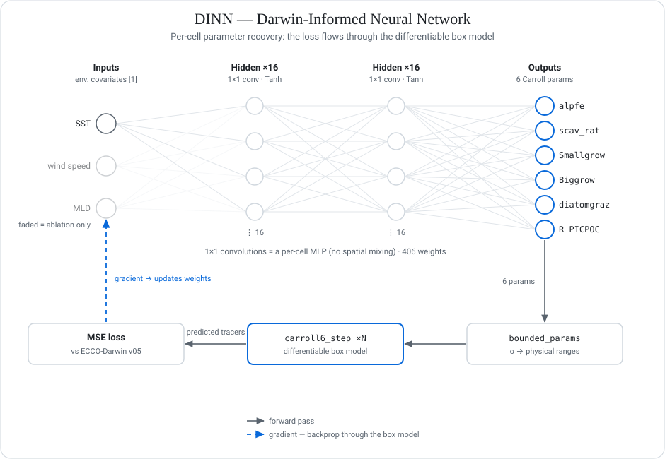

<!-- markdownlint-disable MD033 MD041 -->
<div align="center">

# ECCO-DarwinDiff

**Differentiable ECCO-Darwin for ocean-biogeochemistry parameter recovery via gradient descent through the box model.**



<sub>DarwinDiff's per-cell network (DINN): the loss flows through the differentiable box model, so a single backward pass recovers the six Carroll parameters.</sub>

[Status][status_url] · [Setup](#setup) · [Reproduce](#reproduce) · [Cite](#how-to-cite) · [Acknowledgements](#acknowledgements)

A PyTorch reimplementation of the ECCO-Darwin ocean biogeochemistry model in which gradients
flow through every step of the simulation, so a single loss surface can learn the parameters that
Carroll's Green's-functions calibration tunes one-at-a-time — and let those parameters vary
per grid cell, predicted from local environmental conditions. Manuscript in preparation.

</div>

## Status & scope

- **Active target:** Carroll-6 parameter recovery on ECCO-Darwin v05 (Carroll 2020/2022), a single-method recovery pipeline. Pre-publication; the science moves fast — [STATUS.md][status_url] is canonical for live state.
- **What works today:** four of six Carroll parameters are recoverable from existing v05 observations under at least one AOI configuration; the synthetic per-cell recovery demo runs end-to-end on a laptop / free Colab T4.
- **Known-blocked:** a structural **5/6 ceiling** on joint Carroll-6 recovery from the box model (`R_PICPOC` and `diatomgraz` are the near-unrecoverable params, at 3% and 10% Cal-grade across the sweep), plus the scav_rat–alpfe degeneracy and the 2-basin mutex. Detail and full evidence table in [STATUS.md][status_url].
- **Caveat:** single-GPU (RTX 5090) prototype. Full-ocean recovery, time-resolved fitting, and the Track-2 emulator are gated on cluster access.

## Two tracks

1. **Parameter learner** — replaces ECCO-Darwin's Green's-functions calibration. Where Carroll 2020 / 2022 tunes a global 6-parameter vector via expensive multi-decadal forward runs, DarwinDiff learns a *function* mapping local environmental conditions to a per-cell parameter vector via gradient descent through a differentiable box model.
2. **Emulator** — neural-network stand-in for ECCO-Darwin for long-timescale climate runs. Not started yet.

## Reproduce

The headline finding (the **structural 5/6 ceiling**: 856 seeds across 86 configs, 3-AOI joint
training, 0/856 at 6/6) and its full evidence table live in [STATUS.md][status_url]. To reproduce
the cluster-scale sweep, see [docs/cluster_setup.md][cluster_url].

To see the method itself work end-to-end in a few minutes on a laptop or free Colab T4, the snippet
below recovers a known per-cell parameter field by gradient descent *through* the differentiable
box model — the synthetic analog of the v05 recovery pipeline. Public API verified against
[`src/darwindiff/carroll6.py`][carroll6_url] and [`notebooks/demo_colab.ipynb`][demo_url].

```python
import torch
from darwindiff.carroll6 import (
    CARROLL_VALUES, PARAM_BOUNDS, bounded_params, carroll6_step,
)
from darwindiff.networks import DINN

H, W, N_STEPS, DT = 8, 16, 200, 0.25

# 1. One environmental channel (a z-scored SST gradient) over an 8x16 grid.
sst = torch.linspace(-2.0, 2.0, H).unsqueeze(1) * torch.ones(1, W)
env = ((sst - sst.mean()) / sst.std()).unsqueeze(0)        # [1, H, W]

# 2. Differentiable 5-tracer box model, integrated per cell, returns Ps + Pl biomass.
def forward_box(params):                                    # params: [6, H, W]
    state = torch.stack([
        torch.full((H, W), 0.5e-3), torch.full((H, W), 0.05),
        torch.full((H, W), 0.05),   torch.full((H, W), 0.1),
        torch.full((H, W), 0.001),
    ])
    for _ in range(N_STEPS):
        state = carroll6_step(state, params, DT)
    return state[1] + state[2]

# 3. A truth field where alpfe varies with SST; the rest sit at Carroll's optima.
truth = CARROLL_VALUES.view(6, 1, 1).expand(6, H, W).clone()
truth[0] = 0.30 + (env.squeeze(0) - env.min()) / (env.max() - env.min()) * 0.65
target = forward_box(truth).detach()

# 4. Train a per-cell DINN to recover the truth by backprop THROUGH the box model.
net = DINN(n_input_channels=1, n_outputs=6)
optim = torch.optim.Adam(net.parameters(), lr=5e-3)
for _ in range(800):
    params = bounded_params(net(env), PARAM_BOUNDS, param_axis=0)   # [6, H, W]
    loss = ((forward_box(params) - target) ** 2).mean()
    loss.backward(); optim.step(); optim.zero_grad()

print(f"final loss = {loss.item():.5g}")   # -> ~5e-6; alpfe field recovered per cell
```

Run it from a clone with `src/` on the path (`uv run python your_script.py`). The full annotated
walkthrough (synthetic AOI construction, recovery scatter vs. Carroll's optima) is
[`notebooks/demo_colab.ipynb`][demo_url].

## Setup

```bash
git clone https://github.com/2imi9/ECCO-DarwinDiff.git
cd ECCO-DarwinDiff
uv sync
uv run pytest -q          # smoke test
```

For cluster runs, point the loaders at the LLC270 tree via `DARWIN_DATA_ROOT` (and
`GLODAP_DATA_ROOT` for GLODAP):

```bash
export DARWIN_DATA_ROOT=/scratch/$USER/ecco_darwin_v5
```

Raw data lives outside the repo. Full operational detail — Windows `MAX_PATH` gotchas, the
no-multi-process-CUDA caveat, IC caches, and per-loader data layout — is in
[docs/cluster_setup.md][cluster_url] and [data/README.md][data_url].

## Why this exists

ECCO-Darwin (Carroll et al. 2020, *JAMES*; Carroll et al. 2022, *GBC*) is calibrated via **Green's functions** (Menemenlis et al. 2005), which scales linearly badly: each tuned parameter needs a fresh full forward run, so Carroll's published calibration handles only **6 parameters**. DarwinDiff replaces the biogeochemistry side with **PyTorch autograd**: gradients for all parameters in one backward pass, and the parameter values themselves vary across space — predicted by a small per-cell network (DINN) from local environmental conditions.

<details>
<summary><b>Result history (v2.x → v3.1)</b> — one line per version; STATUS.md is canonical</summary>

| Version | What changed | Outcome |
|---|---|---|
| v0.x → v1.8 (nb 05–19) | methodology validation, real-data demos, multi-tracer joint loss | foundation |
| v2.0 (nb20-21) | carbonate cycle | iron pair to 1.1% / 40% off Carroll |
| v2.1 (nb22, PR #41) | GLODAP real-obs hybrid | `R_PICPOC` 360% → 74% off |
| v2.2 (nb23-29, PR #37) | full 5-PFT box matching Darwin v05 | project-first 4/6 Cal-grade |
| v2.6 (PR #40) | GEOTRACES IDP2025 iron loss | 4/6 reproducibly across n=10 |
| v2.7 (PR #42) | vetted 2-layer integrator | — |
| v2.8 (PR #45) | Darwin v5 ICs + L2 POC obs | project-first reproducible scav_rat recovery |
| v3.0 (PRs #46-#59) | multi-AOI joint training | 5/6 plateau as parameter conservation |
| v3.1 (PR #64) | 3-AOI Basin C + PER_AOI_DINN | two complementary 5/6 paths |
| v3.1.1 (PR #89) | AOI ablation (n=200) | `eqp+natl` recovers `diatomgraz` + `R_PICPOC` at the cost of the iron pair — architecture-level tradeoff; 5/6 ceiling holds |
| Gated on cluster | full-ocean recovery, time-resolved fitting, Track 2 emulator | pending |

Per-phase detail: `docs/findings/`. Live state: [STATUS.md][status_url].

</details>

<details>
<summary><b>Repository layout</b></summary>

```
src/darwindiff/            Python package (importable as `darwindiff`)
  carroll6.py                5-tracer Carroll-6 box + Carroll's optima + bounds
  carbonate.py               Follows-2006 + Wanninkhof 2014 carbonate solver
  carroll6_5pft.py           10-tracer / 5-PFT box matching Darwin v05
  carroll6_5pft_2layer.py    v2.7 2-layer integrator
  networks.py                DINN + DINNRegional + DINNDeep
  ecco_darwin_loader.py      Darwin v05 1° loader + AOI presets
  llc270_loader.py           native LLC270 monthly loader (xmitgcm)
  glodap_loader.py           GLODAPv2.2016b DIC/ALK loader
  modis_pic_loader.py        MODIS-Aqua PIC (shelved for leapfrog)
  pace_loader.py             PACE carbon_phyto (shelved for leapfrog)
scripts/                   runners, overnight sweeps, analysis, SLURM templates
notebooks/                 numbered notebooks 05–32, in arc order; demo_colab.ipynb is the synthetic-recovery walkthrough
tests/                     pytest suite
docs/                      findings, research_notes, dinn_design.md, cluster_setup.md
.claude/skills/            project-scoped skill bundle
```

</details>

<details>
<summary><b>Data sources</b></summary>

**In active use:** ECCO-Darwin v05 (`bin_average` 1° NetCDF + native LLC270 monthly), GLODAPv2.2016b, NASA GHG Center CO₂ flux, GEOTRACES IDP2025.

**Shelved for the leapfrog phase:** GLODAPv2.2023, ocean color (OB.DAAC / OC-CCI), BGC-Argo, SOCAT 2025, WOD / WOA, MODIS-Aqua PIC, PACE carbon_phyto.

Raw data files live outside the repo. Loaders respect `DARWIN_DATA_ROOT` / `GLODAP_DATA_ROOT` env vars. See [data/README.md][data_url] for canonical URLs.

</details>

<details>
<summary><b>Background reading</b> (all DOIs verified via OpenAlex)</summary>

**ECCO-Darwin lineage (active recovery target):**

| Reference | Why it matters |
|---|---|
| [Carroll et al. 2020](https://doi.org/10.1029/2019MS001888) (*JAMES*) | Original ECCO-Darwin paper; the 6-parameter Green's-functions calibration we differentiate against. |
| [Carroll et al. 2022](https://doi.org/10.1029/2021GB007162) (*GBC*) | ECCO-Darwin v05; the publicly-accessible Darwin output is our active recovery target. |
| [Brix et al. 2015](https://doi.org/10.1016/j.ocemod.2015.07.008) (*Ocean Modelling*) | Earlier ECCO-Darwin BGC, using Green's-functions to initialize/adjust the model. |
| [Savelli et al. 2026](https://doi.org/10.5194/gmd-19-867-2026) (*GMD*) | Most recent ECCO-Darwin update; riverine biogeochemical inputs. |

**Box-model physics & chemistry (in `src/darwindiff/`):**

| Reference | Used in |
|---|---|
| [Dutkiewicz et al. 2009](https://doi.org/10.1029/2008GB003405) (*GBC*) | Core Darwin biogeochemistry equations (`carroll6.py`, `carroll6_5pft.py`). |
| [Follows, Ito, Dutkiewicz 2006](https://doi.org/10.1016/j.ocemod.2005.05.004) (*Ocean Modelling*) | Iterative carbonate-system solver implemented in `carbonate.py`. |
| [Wanninkhof 2014](https://doi.org/10.4319/lom.2014.12.351) (*L&O Methods*) | Wind-speed–gas-exchange coefficient for air-sea CO₂ flux in `carbonate.py`. |
| [Menemenlis et al. 2005](https://doi.org/10.1175/MWR2912.1) (*MWR*) | The Green's-functions calibration method DarwinDiff replaces. |

**Observational data (loaders + losses):**

| Reference | Used in |
|---|---|
| [Olsen et al. 2016](https://doi.org/10.5194/essd-8-297-2016) (*ESSD*) | GLODAPv2 mapped DIC/ALK in `glodap_loader.py` (v2.1, PR #41). |
| [Schlitzer et al. 2018](https://doi.org/10.1016/j.chemgeo.2018.05.040) (*Chemical Geology*) | GEOTRACES IDP iron observations (v2.6, PR #40). |

**Method templates (differentiable physics + ML for Earth science):**

| Reference | Why it matters |
|---|---|
| [Xu et al. 2025](https://arxiv.org/abs/2502.00672) (BINN) | Differentiable physics + per-location parameter network — closest method template. |
| [Kochkov et al. 2024](https://arxiv.org/abs/2311.07222) (Neural GCM, *Nature*) | Hybrid physics + ML emulator design reference for Track 2. |
| [Ouala & Lachkar 2026](https://doi.org/10.22541/essoar.15002003/v1) (Neural-BGC) | Closest existing ocean-BGC ML; DarwinDiff differs by being mechanistic + parameter-aware. |

</details>

## Acknowledgements

Institutional acknowledgements for the in-development repository (individual credits to follow in the manuscript):

- **MIT Department of Earth, Atmospheric, and Planetary Sciences (EAPS)** — research collaboration on ECCO-Darwin and the differentiable-physics parameter-learning approach.
- **MIT Office of Research Computing and Data (ORCD)** — Engaging cluster and AICR (B200) beta program.
- **JPL ECCO Group** and the **NASA Advanced Supercomputing (NAS)** division — ECCO-Darwin v05 outputs.
- **GLODAP**, **GEOTRACES**, and the **NASA GHG Center** — observational data products that are active recovery targets in v3.1.

Method-inspiration citations (PINN, BINN, Neural GCM, Neural-BGC, the full ECCO-Darwin lineage) are listed in the [Background reading](#background-reading) section above with verified DOIs.

## License

Released under the **MIT License**. See [LICENSE](LICENSE) for full text. Copyright © 2026 ECCO-DarwinDiff contributors.

The underlying ECCO-Darwin model is the work of the ECCO and Darwin teams and should be credited independently in any downstream work; see citation block below.

## How to cite

DarwinDiff is under active development; a formal manuscript and Zenodo DOI will be issued upon publication. In the interim, cite the repository directly:

```bibtex
@software{darwindiff_2026,
  author    = {{ECCO-DarwinDiff contributors}},
  title     = {{ECCO-DarwinDiff}: Differentiable Ocean Biogeochemistry
               for Per-Cell Parameter Recovery},
  year      = {2026},
  publisher = {GitHub},
  url       = {https://github.com/2imi9/ECCO-DarwinDiff}
}
```

<details>
<summary><b>If your work depends on the underlying ECCO-Darwin model, also cite:</b></summary>

```bibtex
@article{carroll2020eccoDarwin,
  title   = {The {ECCO}-{Darwin} data-assimilative global ocean
             biogeochemistry model: Estimates of seasonal to multidecadal
             surface ocean p{CO}$_2$ and air-sea {CO}$_2$ flux},
  author  = {Carroll, Dustin and Menemenlis, Dimitris and Adkins, Jess F.
             and Bowman, Kevin W. and Brix, Holger and Dutkiewicz,
             Stephanie and others},
  journal = {Journal of Advances in Modeling Earth Systems},
  volume  = {12},
  number  = {10},
  pages   = {e2019MS001888},
  year    = {2020},
  doi     = {10.1029/2019MS001888}
}

@article{carroll2022eccoDarwinDIC,
  title   = {Attribution of space-time variability in global-ocean
             dissolved inorganic carbon},
  author  = {Carroll, Dustin and Menemenlis, Dimitris and Dutkiewicz,
             Stephanie and Lauderdale, Jonathan M. and Adkins, Jess F.
             and Bowman, Kevin W. and others},
  journal = {Global Biogeochemical Cycles},
  volume  = {36},
  number  = {4},
  pages   = {e2021GB007162},
  year    = {2022},
  doi     = {10.1029/2021GB007162}
}
```

</details>

<!-- Reference links -->
[status_url]: STATUS.md
[cluster_url]: docs/cluster_setup.md
[data_url]: data/README.md
[carroll6_url]: src/darwindiff/carroll6.py
[demo_url]: notebooks/demo_colab.ipynb
