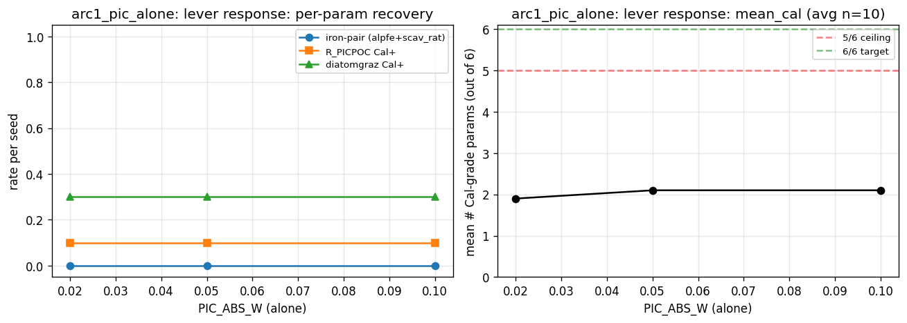
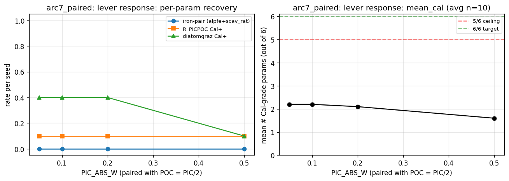

# Basin C overnight 2026-05-19/20 — all-waves analysis (20260520_1158)

> **⚠ SUPERSEDED FRAMING (2026-06-28).** Point-in-time record; data stands, framing corrected by [STATUS.md](../../../../STATUS.md). The project is a surrogate-to-model identifiability study over **4 observable params**; the growth pair is unobservable by construction. **R_PICPOC is recoverable** with a real calcite anchor (the '5/6 ceiling / 6/6 wall / needs the Darwin port + native resolution' framing is refuted). The per-cell predictor is load-bearing for the target trio (ablation 7/10 vs 0/10, PR #158).

## Source roots

- wave3: `None`
- wave2: `None`
- wave1: `D:\runs\bcr_20260520_0121`

## Top 20 configs (paper-relevant ranking)

| Rank | Wave | Config | 6+/n | 5+/n | iron-pair | R_PICPOC | diatomgraz | mean_cal | tot_exc |
|---|---|---|---|---|---|---|---|---|---|
| 1 | wave1 | arc6_basinC_seeds10-19 | 0/10 | 0/10 | 10/10 | 0/10 | 0/10 | 2.50 | 7 |
| 2 | wave1 | arc7_pp_0.05_0.025 | 0/10 | 0/10 | 0/10 | 1/10 | 4/10 | 2.20 | 4 |
| 3 | wave1 | a1_pic_010 | 0/10 | 0/10 | 0/10 | 1/10 | 3/10 | 2.10 | 4 |
| 4 | wave1 | a1_pic_005 | 0/10 | 0/10 | 0/10 | 1/10 | 3/10 | 2.10 | 3 |
| 5 | wave1 | arc7_pp_0.10_0.05 | 0/10 | 0/10 | 0/10 | 1/10 | 4/10 | 2.20 | 2 |
| 6 | wave1 | a7_pp_20_10 | 0/10 | 0/10 | 0/10 | 1/10 | 4/10 | 2.10 | 1 |
| 7 | wave1 | a7_pp_50_25 | 0/10 | 0/10 | 0/10 | 1/10 | 1/10 | 1.60 | 1 |
| 8 | wave1 | a1_pic_002 | 0/10 | 0/10 | 0/10 | 1/10 | 3/10 | 1.90 | 0 |

## 6/6 hits

(none — 5/6 remains the laptop ceiling)

## Iron-pair survival summary

- **Iron-pair holds (≥8/n):** 1 configs
- **Partial (1-7/n):** 0 configs
- **Collapsed (0/n):** 7 configs

## Basin C iron-pair recovery across combined seeds

Total seeds at Basin C base: **10**
Iron-pair (alpfe+scav_rat both Cal+): **10/10** (100%)

- `arc6_basinC_seeds10-19` (wave1): iron-pair=10/10

## Figures

