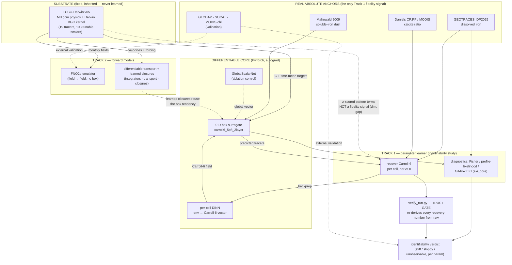
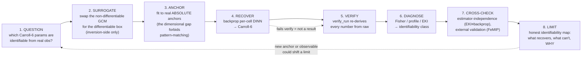

# ECCO-DarwinDiff — element coupling & scientific workflow

How the project's parts connect, and how they operate together as a scientific method. Companion to
[docs/project_map.md](project_map.md) (the layered overview) and
[docs/ecco_darwin_relationship.md](ecco_darwin_relationship.md) (where we sit vs the real Darwin code).
Two views: the **coupling graph** (static structure — what feeds what) and the **workflow cycle**
(the dynamic method — how a claim gets made and trusted).

---

## 1. Coupling graph — what feeds what

**The load-bearing edges (why each matters):**

- **v05 → box (IC + targets), not v05 → box (fidelity).** The box inherits v05 initial conditions and its
  time-mean fields are *targets*, but because the 0-D box homogenizes spatial structure (tracer
  CV → ~1e-15), the dashed `v05 ⇢ REC` pattern edge is **not a fidelity signal** — it is z-scored
  scaffolding. This is the *dimensional surrogate gap*, and it is why the solid fidelity edges come only
  from the **real absolute anchors** (iron, calcite).
- **DINN → box → recover → backprop → DINN** is the core learning loop: a per-cell parameter field is
  pushed through the differentiable box, compared to anchors, and the gradient flows back to the network.
  Replacing `DINN` with `GlobalScalarNet` (the dashed control) is the load-bearing ablation: per-cell
  holds the trio, global holds 0.
- **Everything recovery-related passes through `verify_run` before it is a number.** No edge reaches
  `VERDICT` without the trust gate.
- **Track 2 is decoupled from the box.** The emulator learns field→field directly (no box); the UDE
  *reuses* the box tendency as pluggable closures over real transport. They share the substrate and the
  anchors, not the inversion machinery.

---

## 2. The scientific-workflow cycle — how a claim gets made and trusted

**The methodological commitments encoded in this cycle:**

1. **Question is identifiability, not score.** We ask *which* parameters are recoverable and *why*, not
   "how many of 6." The denominator is the 4 observable params; the growth pair is excluded by
   construction (no real-world constraint exists).
2. **The surrogate is an inversion-side estimator, not a model claim.** The box replaces the ~7-forward
   Green's-functions gradient; it does *not* claim to be Darwin. Its gap is characterized, not hidden.
3. **Fidelity = real absolute anchors.** Because the surrogate gap is dimensional, only Darwin-independent
   observations (iron, calcite) can constrain a parameter; box-vs-Darwin correlations cannot.
4. **Nothing is a number until `verify_run` blesses it.** The trust gate re-derives every band from raw
   per-seed output and exits zero only on agreement — the anti-hallucination spine.
5. **Identifiability is diagnosed, not asserted.** Every recovery/non-recovery is backed by a Fisher
   eigenspectrum, a profile likelihood, or an EKI posterior — a *reason*, not just a count.
6. **Claims are cross-checked for method-independence and against the literature.** A recovery must
   survive an estimator swap (derivative-free EKI reaching the same verdict as backprop) and, where
   possible, map onto a published effect (the FeMIP iron degeneracy).
7. **The output is a limit, honestly stated.** The deliverable is the identifiability map — including what
   *cannot* be recovered and the observing-system reason — not a headline recovery.

---

## 3. The trust & provenance spine (cross-cutting)

Every claim rides three rails that run underneath both views:

| rail | mechanism | guarantees |
|---|---|---|
| **Verification** | `verify_run.py` (recovery), the script's own `--recheck` (sign-flip), `verify` exit-0 gate | no number is quoted that was not re-derived from raw |
| **Reproducibility** | `carroll6.PARAMS` single-source registry, pinned `uv.lock`, env-var lever set, seed disclosure (n≥10) | any run is reconstructable from the recorded config |
| **Adversarial review** | pre-registration, red-team panels, decisiveness vetting, estimator-independence | a claim survives a hostile reader before it ships |

---

## 4. Where the pieces live (code map)

| element | file(s) |
|---|---|
| box surrogate | `src/darwindiff/carroll6_5pft_2layer.py` (+ `carbonate.py`) |
| DINN / control | `src/darwindiff/networks.py` |
| Track-1 driver | `scripts/run_v3.0_joint_multi_aoi.py` (env-var levers) |
| trust gate | `scripts/verify_run.py` |
| identifiability diagnostics | `scripts/identifiability_sloppiness.py`, `scripts/analysis/eki_core.py`, `scripts/analysis/eki_fullbox_trio.py` |
| forward emulator | `scripts/emulator_poc.py`, `scripts/diffusion_emulator.py` |
| UDE | `src/darwindiff/{integrators,transport,closures}.py` |
| anchors / loaders | `src/darwindiff/{geotraces,daniels,iron_forcing,velocity}_loader.py` |

---

## 5. How the literature makes this kind of claim credible (and where we sit)

A Fable pass over all 20 citations (studying *how* each established its result) converges on one standard:
**credibility in calibration is not hitting a target — it is honestly diagnosing what the data cannot
constrain, in a basis of parameter *combinations*, with an explicit model-discrepancy term in the
denominator, corroborated by estimator-independence.** Every credible paper makes the same four moves,
which map directly onto our workflow cycle above:

| the field's credibility move | our workflow step | status |
|---|---|---|
| read identifiability off `g = JᵀJ`, in **combinations** not bare parameters (Transtrum, Raue, Evensen) | 6. Diagnose | **doing** — but report the alpfe↔scav_rat *eigenvector*, not "diatomgraz is flat" |
| carry an explicit **discrepancy δ in the denominator** so a wrong model can't buy a good fit (Kennedy–O'Hagan, Williamson) | 3. Anchor | **make it the spine** — name the 0-D gap a KOH δ; anchors-only vs pattern-only *is* KOH's credibility ablation |
| report **ranges/limits, name the structurally unconstrained** (Menemenlis 15.1±12, Williamson) | 8. Limit | **make it the headline**, not the caveat |
| corroborate with an **independent estimator + reference-free check** (Schneider, CES, BINN-vs-PRODA) | 7. Cross-check | **doing** — full-box EKI ≡ backprop; physics-verify |

**The three highest-leverage moves for the manuscript** (full detail + the not-for-us list in
[docs/findings/2026-07-22_citation_method_lessons.md](findings/2026-07-22_citation_method_lessons.md)):

1. **Frame the whole result in Carroll's own control basis + absolute-anchor observable set** — so it
   reads as a rank/conditioning statement about the Jacobian ECCO-Darwin's community already inverts.
   "Not 6/6" becomes "which directions of a trusted control vector are constrained."
2. **Adopt Raue's structural-vs-practical taxonomy** — alpfe↔scav_rat rank-1 = structural (the published
   Parekh FeMIP trade); the 0-D gap = practical (resolved by an absolute anchor).
3. **Select GEOTRACES anchors to maximize aeolian-supply contrast** (high-dust N.Atl vs low-dust remote
   Pacific/SO) — cross-region contrast is what lifts the source↔scavenging null, not iron magnitude at one
   site (Parekh + Somes 2021's controlled demonstration).

**The through-line a reviewer should take away:** five independent methods (EnKF rank≤N−1, CES flat ridge,
history-matching NROY, KOH θ–δ ridge, SINDy non-uniqueness) all hit the same wall — **no estimator breaks a
rank-1 structural null.** Our single-realization + rank-1 + dimensional-gap constraints are therefore not
weaknesses to apologize for; they are the *content*: this project is **the identifiability audit of a
trusted calibration**, not a failed recovery.
